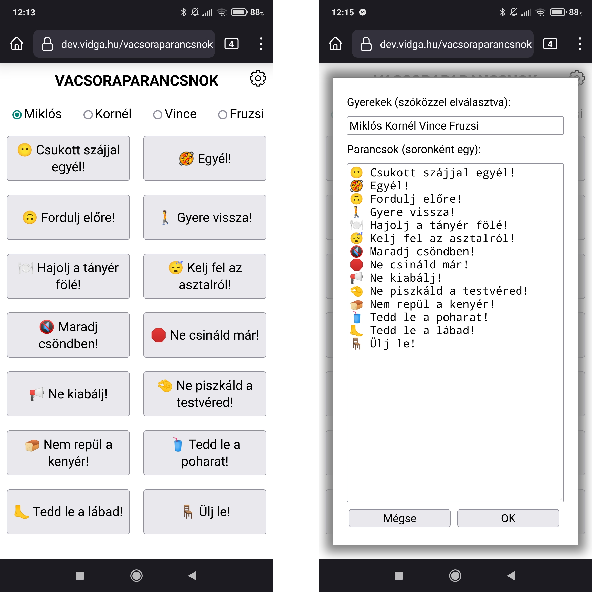

<a href="https://github.com/dhanak/dinnercommander" class="github-corner" aria-label="View source on GitHub"><svg width="80" height="80" viewBox="0 0 250 250" style="fill:#151513; color:#fff; position: absolute; top: 0; border: 0; right: 0;" aria-hidden="true"><path d="M0,0 L115,115 L130,115 L142,142 L250,250 L250,0 Z"></path><path d="M128.3,109.0 C113.8,99.7 119.0,89.6 119.0,89.6 C122.0,82.7 120.5,78.6 120.5,78.6 C119.2,72.0 123.4,76.3 123.4,76.3 C127.3,80.9 125.5,87.3 125.5,87.3 C122.9,97.6 130.6,101.9 134.4,103.2" fill="currentColor" style="transform-origin: 130px 106px;" class="octo-arm"></path><path d="M115.0,115.0 C114.9,115.1 118.7,116.5 119.8,115.4 L133.7,101.6 C136.9,99.2 139.9,98.4 142.2,98.6 C133.8,88.0 127.5,74.4 143.8,58.0 C148.5,53.4 154.0,51.2 159.7,51.0 C160.3,49.4 163.2,43.6 171.4,40.1 C171.4,40.1 176.1,42.5 178.8,56.2 C183.1,58.6 187.2,61.8 190.9,65.4 C194.5,69.0 197.7,73.2 200.1,77.6 C213.8,80.2 216.3,84.9 216.3,84.9 C212.7,93.1 206.9,96.0 205.4,96.6 C205.1,102.4 203.0,107.8 198.3,112.5 C181.9,128.9 168.3,122.5 157.7,114.1 C157.9,116.9 156.7,120.9 152.7,124.9 L141.0,136.5 C139.8,137.7 141.6,141.9 141.8,141.8 Z" fill="currentColor" class="octo-body"></path></svg></a>

# Dinner Commander

Are you fed up with your kids not behaving themselves during family dinner? Have
you had enough of having to reproach your children for the same stuff over and
over again? Of losing your patience and self control?

Fret no more, [Dinner Commander][dinnercommander] is here to the resuce! Just
open this HTML applcation in your favorite mobile browser, connect your phone to
your favorite Bluetooth loudspeakers, select the name of the problematic child,
push the command button most suited for the situation, and listen with
satisfaction how your phone's speech synthetiser tells your child to behave,
without losing its temper, raising its voice, or going mad. And you can proceed
to consume your delicious dinner.

Do your kids have a different name, or do they need to be told off for different
things? Have no fear, you can set up all these details easily after clicking on
the little cogwheel in the upper right corner! You can also select the language
you would like to use (primarily for the voice, but also for the interface if a
translation is available). The settings are saved, too, until next time.

[Dinner Commander][dinnercommander] is here to save your evening! 😍🥐

[dinnercommander]: https://dev.vidga.hu/dinnercommander
